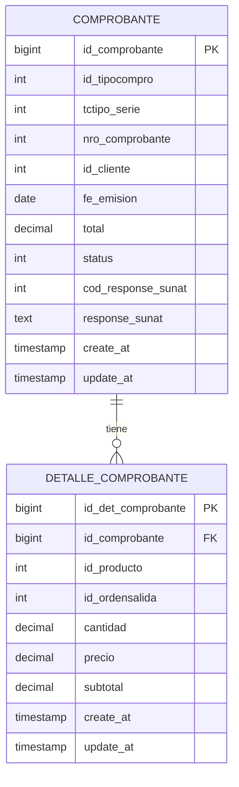

# 📋 **Entidades Module-Ecomprobantes**

## 🎯 **Visión General**

Este módulo implementa entidades R2DBC reactivas para el manejo de **comprobantes electrónicos SUNAT** siguiendo **arquitectura hexagonal** y principios **SOLID**.

### **📊 Estructura de Datos**



---

## 🏗️ **Arquitectura Hexagonal**

### **📦 Estructura por Capas**

```
module-ecomprobantes/
├── domain/                           # 🎯 DOMINIO (Core Business)
│   └── model/                        # Entidades de dominio puras
├── infrastructure/                   # 🔧 INFRAESTRUCTURA
│   └── adapters/
│       └── outbound/
│           └── persistence/
│               ├── entity/           # ✅ Entidades R2DBC (DB)
│               ├── repository/       # ✅ Repositorios reactivos
│               └── adapter/          # Adaptadores de persistencia
```

### **🎯 Principios Aplicados**

- **Single Responsibility**: Cada entidad tiene una responsabilidad específica
- **Open/Closed**: Extensible para nuevos tipos de comprobantes
- **Dependency Inversion**: Repositorios dependen de abstracciones
- **Interface Segregation**: Repositorios específicos por entidad

---

## 📋 **Entidades Implementadas**

### **1. 🧾 ComprobanteEntity**

**Tabla**: `facturacion.tbcomprobantes`

#### **📝 Características**

- ✅ **R2DBC Reactive Entity** para PostgreSQL
- ✅ **Auditoría automática** (`@CreatedDate`, `@LastModifiedDate`)
- ✅ **Builder Pattern** para construcción inmutable
- ✅ **Métodos de negocio** para lógica específica de comprobantes
- ✅ **Validaciones** integradas para integridad de datos

#### **🎯 Métodos de Negocio**

```java
// Verificar estado del comprobante
comprobante.isActivo();                    // true si no está anulado
comprobante.isEnviadoSunat();             // true si hay respuesta SUNAT
comprobante.isAceptadoPorSunat();         // true si código = 0

// Obtener información formateada
comprobante.getNumeroCompleto();          // "S001-00000123"
comprobante.calcularTotal();              // subtotal + igv

// Verificar configuraciones
comprobante.aplicaDetraccion();           // true si aplica
comprobante.isInafecta();                 // true si es inafecta
```

#### **🔧 Campos Principales**

| Campo                 | Tipo         | Descripción                      |
| --------------------- | ------------ | -------------------------------- |
| `idComprobante`       | `Long`       | ID único del comprobante         |
| `idTipoComprobante`   | `Integer`    | Tipo (Factura=1, Boleta=2, etc.) |
| `tipoSerie`           | `Integer`    | Serie del comprobante            |
| `numeroComprobante`   | `Integer`    | Número correlativo               |
| `idCliente`           | `Integer`    | ID del cliente                   |
| `fechaEmision`        | `LocalDate`  | Fecha de emisión                 |
| `subtotal`            | `BigDecimal` | Subtotal sin IGV                 |
| `igv`                 | `BigDecimal` | Monto del IGV                    |
| `total`               | `BigDecimal` | Total final                      |
| `codigoResponseSunat` | `Integer`    | Código respuesta SUNAT           |
| `responseSunat`       | `String`     | Mensaje de SUNAT                 |

---

### **2. 📄 DetalleComprobanteEntity**

**Tabla**: `facturacion.tbdet_comprobantes`

#### **📝 Características**

- ✅ **Relación con ComprobanteEntity** vía `idComprobante`
- ✅ **Cálculos automáticos** de subtotales y descuentos
- ✅ **Validaciones** para consistencia de datos
- ✅ **Soporte para servicios y productos físicos**

#### **🎯 Métodos de Negocio**

```java
// Cálculos automáticos
detalle.calcularSubtotal();               // cantidad * precio
detalle.calcularDescuento();              // precioOriginal - precio
detalle.calcularPorcentajeDescuento();    // % de descuento
detalle.calcularPesoTotal();              // peso * cantidad

// Validaciones
detalle.isLineaValida();                  // valida cantidad, precio, etc.
detalle.tieneDescuento();                 // true si hay descuento
detalle.esServicio();                     // true si peso = 0
detalle.estaVinculadaOrdenSalida();       // true si tiene orden
```

#### **🔧 Campos Principales**

| Campo                  | Tipo         | Descripción                   |
| ---------------------- | ------------ | ----------------------------- |
| `idDetalleComprobante` | `Long`       | ID único del detalle          |
| `idComprobante`        | `Long`       | FK al comprobante padre       |
| `idProducto`           | `Integer`    | ID del producto/servicio      |
| `idOrdenSalida`        | `Integer`    | ID orden de salida (opcional) |
| `cantidad`             | `BigDecimal` | Cantidad del producto         |
| `precio`               | `BigDecimal` | Precio unitario final         |
| `precioOriginal`       | `BigDecimal` | Precio antes de descuento     |
| `subtotal`             | `BigDecimal` | Total de la línea             |
| `peso`                 | `BigDecimal` | Peso unitario                 |

---

## 📊 **Repositorios Reactivos**

### **🔄 ComprobantesRepository**

#### **🎯 Consultas Principales**

```java
// Búsquedas por identificadores
Mono<ComprobanteEntity> findByTipoSerieNumero(tipo, serie, numero);
Mono<ComprobanteEntity> findByNumeroTicket(ticket);

// Consultas por cliente
Flux<ComprobanteEntity> findByClienteActivos(idCliente);
Flux<ComprobanteEntity> findByClienteAndFechaRange(idCliente, fechaInicio, fechaFin);

// Estado SUNAT
Flux<ComprobanteEntity> findPendientesEnvioSunat();
Flux<ComprobanteEntity> findRechazadosPorSunat();
Flux<ComprobanteEntity> findAceptadosPorSunat();

// Operaciones de estado
Mono<Integer> anularComprobante(idComprobante);
Mono<Integer> updateResponseSunat(id, codigo, respuesta);

// Utilidades
Mono<Integer> getNextNumeroComprobante(tipo, serie);
```

### **📋 DetalleComprobantesRepository**

#### **🎯 Consultas Principales**

```java
// Por comprobante
Flux<DetalleComprobanteEntity> findByIdComprobante(idComprobante);
Mono<Long> countByIdComprobante(idComprobante);

// Agregaciones
Mono<BigDecimal> calcularSubtotalComprobante(idComprobante);
Mono<BigDecimal> calcularCantidadTotalComprobante(idComprobante);
Mono<BigDecimal> calcularPesoTotalComprobante(idComprobante);

// Por producto
Flux<DetalleComprobanteEntity> findByIdProducto(idProducto);
Flux<DetalleComprobanteEntity> findByComprobanteAndProducto(idComp, idProd);

// Por orden de salida
Flux<DetalleComprobanteEntity> findByIdOrdenSalida(idOrden);
Mono<DetalleComprobanteEntity> findByOrdenSalidaAndDetalle(idOrden, idDetalle);

// Operaciones en lote
Mono<Integer> deleteByIdComprobante(idComprobante);
```

---

## ⚙️ **Configuración**

### **🔧 R2DBC Configuration**

```java
@Configuration
@EnableR2dbcRepositories(basePackages = "...repository")
@EnableR2dbcAuditing(auditorAwareRef = "comprobantesAuditorProvider")
public class ComprobantesR2dbcConfig {

    @Bean("comprobantesAuditorProvider")
    public ReactiveAuditorAware<String> comprobantesAuditorProvider() {
        return () -> Mono.just("SISTEMA_ECOMPROBANTES");
    }
}
```

### **📋 YAML Configuration**

```yaml
spring:
  r2dbc:
    url: r2dbc:postgresql://127.0.0.1:5432/erp_tlm_2021
    pool:
      enabled: true
      max-size: 20
      initial-size: 5
    properties:
      timezone: America/Lima
      application-name: module-ecomprobantes

logging:
  level:
    com.walrex.module_ecomprobantes.infrastructure.adapters.outbound.persistence: DEBUG
    org.springframework.data.r2dbc: DEBUG
```

---

## 🎯 **Casos de Uso Típicos**

### **1. 📝 Crear Comprobante con Detalles**

```java
@Service
public class CrearComprobanteService {

    public Mono<ComprobanteEntity> crearComprobante(CrearComprobanteRequest request) {
        return comprobantesRepository.getNextNumeroComprobante(request.getTipo(), request.getSerie())
            .flatMap(nextNumero -> {
                ComprobanteEntity comprobante = ComprobanteEntity.builder()
                    .idTipoComprobante(request.getTipo())
                    .tipoSerie(request.getSerie())
                    .numeroComprobante(nextNumero)
                    .idCliente(request.getIdCliente())
                    .fechaEmision(LocalDate.now())
                    .subtotal(request.getSubtotal())
                    .igv(request.getIgv())
                    .total(request.getTotal())
                    .build();

                return comprobantesRepository.save(comprobante);
            })
            .flatMap(comprobanteSaved ->
                crearDetalles(comprobanteSaved.getIdComprobante(), request.getDetalles())
                    .then(Mono.just(comprobanteSaved))
            );
    }
}
```

### **2. 🔍 Consultar Comprobantes por Cliente**

```java
public Flux<ComprobanteEntity> consultarComprobantesPorCliente(Integer idCliente,
                                                              LocalDate fechaInicio,
                                                              LocalDate fechaFin) {
    return comprobantesRepository.findByClienteAndFechaRange(idCliente, fechaInicio, fechaFin)
        .filter(ComprobanteEntity::isActivo);
}
```

### **3. 📊 Procesar Lote SUNAT**

```java
public Flux<ComprobanteEntity> procesarLoteSunat() {
    return comprobantesRepository.findPendientesEnvioSunat()
        .take(50) // Procesar en lotes de 50
        .flatMap(this::enviarASunat)
        .flatMap(comprobante ->
            comprobantesRepository.updateResponseSunat(
                comprobante.getIdComprobante(),
                comprobante.getCodigoResponseSunat(),
                comprobante.getResponseSunat()
            ).thenReturn(comprobante)
        );
}
```

---

## 🎊 **Beneficios Conseguidos**

### **✅ Arquitectura Hexagonal**

- **Separación clara** entre dominio e infraestructura
- **Testability** mejorada con mocks de repositorios
- **Flexibilidad** para cambiar implementación de persistencia

### **⚡ Reactive Programming**

- **Alto rendimiento** con operaciones no-bloqueantes
- **Escalabilidad** mejorada para alta concurrencia
- **Backpressure** automático con Flux/Mono

### **🔧 Clean Code**

- **Métodos de negocio** expresivos y autoexplicativos
- **Builder Pattern** para construcción clara
- **Validaciones** integradas en las entidades

### **📊 Observabilidad**

- **Auditoría automática** de cambios
- **Logging detallado** para debugging
- **Métricas** integradas para monitoreo

---

## 🚀 **Próximos Pasos**

1. **🧪 Tests Unitarios** con StepVerifier y TestContainers
2. **🔄 Mappers** entre entidades y modelos de dominio
3. **📝 Servicios de Dominio** para lógica de negocio
4. **🌐 APIs REST** reactivas con RouterFunction
5. **📡 Integración Kafka** para eventos de comprobantes

¡Las entidades están listas para usar! 🎉
